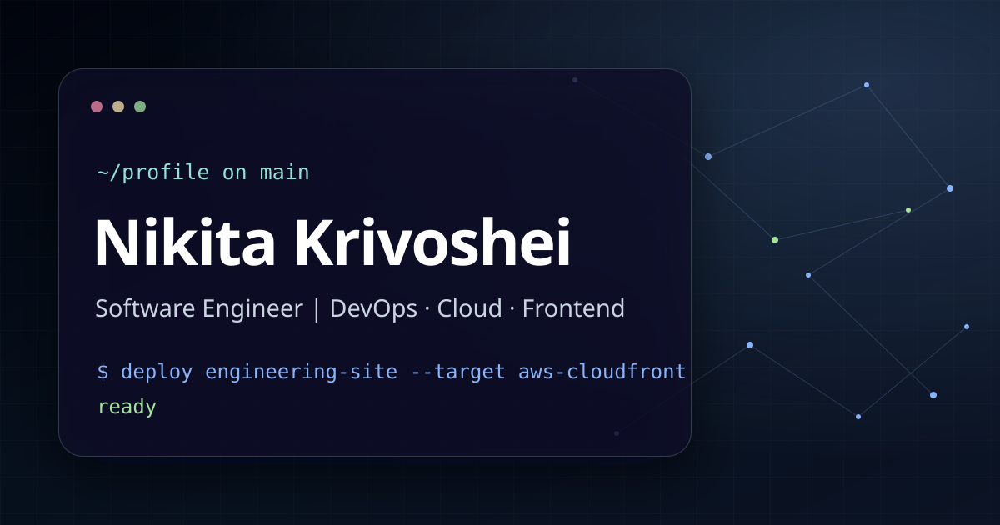

<div align="center">

# Nikita Krivoshei — Personal Engineering Website

Personal engineering website presenting work history, technical background, selected projects, and repositories. Built with Astro, TypeScript, Tailwind CSS, and GitHub Actions.

[](https://krivoshei.dev)
[](https://github.com/itkrivoshei/itkrivoshei.github.io/actions/workflows/check.yml)
[](https://github.com/itkrivoshei/itkrivoshei.github.io/actions/workflows/deploy.yml)
[](https://github.com/itkrivoshei/itkrivoshei.github.io/actions/workflows/codeql.yml)
[](LICENSE)

<br />

[](https://github.com/itkrivoshei)
[](https://linkedin.com/in/itkrivoshei)
[](mailto:nikitakrivoshei@gmail.com)
[](https://t.me/itkrivoshei)

<br />

[](https://krivoshei.dev)

</div>

## Architecture

Work history, skills, selected projects, availability, and contact links live in the typed [`src/data/profile.ts`](src/data/profile.ts) source. [Astro](https://astro.build/) components render that content, while [Tailwind CSS v4](https://tailwindcss.com/) tokens and focused custom CSS provide the glass surfaces, grid/network background, visual depth, and scroll-depth darkening.

Suitable desktop devices load the [custom canvas network](src/scripts/network-background.ts) and [page motion runtime](src/scripts/page-motion.ts), which use [GSAP ScrollTrigger](https://gsap.com/docs/v3/Plugins/ScrollTrigger/) and [Lenis](https://lenis.darkroom.engineering/). Mobile, coarse-pointer, reduced-motion, and no-JavaScript environments retain the static presentation without loading those optional runtimes.

## Tech Stack

| Area      | Tools                                                                                                                                                                                                |
| --------- | ---------------------------------------------------------------------------------------------------------------------------------------------------------------------------------------------------- |
| Framework | [Astro 6](https://astro.build/)                                                                                                                                                                      |
| Language  | [TypeScript](https://www.typescriptlang.org/)                                                                                                                                                        |
| Styling   | [Tailwind CSS 4](https://tailwindcss.com/), custom glass surfaces                                                                                                                                    |
| Effects   | [Custom canvas network background](src/scripts/network-background.ts), [GSAP ScrollTrigger](https://gsap.com/docs/v3/Plugins/ScrollTrigger/), [Lenis](https://lenis.darkroom.engineering/)           |
| Runtime   | [Node.js 22](https://nodejs.org/), [npm](https://www.npmjs.com/)                                                                                                                                     |
| Checks    | [Prettier](https://prettier.io/), [ESLint](https://eslint.org/), Astro check, HTML validation, link checks, [Playwright](https://playwright.dev/), [axe-core](https://github.com/dequelabs/axe-core) |
| Hosting   | [GitHub Pages](https://pages.github.com/)                                                                                                                                                            |
| Container | [Docker](https://www.docker.com/), [nginx](https://nginx.org/)                                                                                                                                       |
| Updates   | [Dependabot](.github/dependabot.yml)                                                                                                                                                                 |

## Local Workflow

```bash
git clone https://github.com/itkrivoshei/itkrivoshei.github.io.git
cd itkrivoshei.github.io

# If you use nvm, this reads .node-version and selects Node.js 22.
nvm use

npm ci

# Required once for browser smoke tests.
npx playwright install chromium

npm run dev
```

Production build and preview:

```bash
npm run build
npm run preview
```

Full local validation:

```bash
npm run verify
npm run test:smoke
npm run test:container
```

## Scripts

| Command                       | Purpose                                            |
| ----------------------------- | -------------------------------------------------- |
| `npm run dev`                 | Start Astro locally                                |
| `npm run check`               | Run Astro checks                                   |
| `npm run build`               | Build `dist/`                                      |
| `npm run preview`             | Preview the production build                       |
| `npm run lint`                | Run ESLint for TypeScript, JavaScript, and Astro   |
| `npm run validate:html`       | Validate generated HTML                            |
| `npm run test:links:internal` | Check local pages, assets, CSS URLs, and fragments |
| `npm run test:links:external` | Report unavailable external links                  |
| `npm run test:smoke`          | Run Playwright and axe-core browser smoke tests    |
| `npm run test:container`      | Build and smoke-test the nginx container           |
| `npm run validate:bundle`     | Enforce CSS and runtime bundle budgets             |
| `npm run format`              | Format Astro, JS/TS, CSS, docs, and YAML           |
| `npm run format:check`        | Check formatting, including `.astro` files         |
| `npm run verify`              | Run the complete non-browser CI quality gate       |
| `npm run ready`               | Format first, then run the verification gate       |
| `npm run hooks:install`       | Enable local Git hooks                             |
| `npm run hooks:remove`        | Disable local Git hooks                            |

## Docker

Docker image configuration is defined in [`Dockerfile`](Dockerfile).

```bash
docker build -t itkrivoshei-site .
docker run --rm -p 8080:80 itkrivoshei-site
```

Open `http://localhost:8080`.

The container uses [`nginx/default.conf`](nginx/default.conf) to serve the branded 404 page, immutable hashed assets, and baseline security headers.

## Automation

- [`.github/workflows/check.yml`](.github/workflows/check.yml) runs the quality gate, browser/accessibility and container smoke tests, and a non-blocking external-link report.
- [`.github/workflows/deploy.yml`](.github/workflows/deploy.yml) runs verification and browser smoke tests before publishing `dist` to [GitHub Pages](https://krivoshei.dev) on pushes to [`main`](https://github.com/itkrivoshei/itkrivoshei.github.io/tree/main).
- [`.github/workflows/codeql.yml`](.github/workflows/codeql.yml) runs GitHub [CodeQL](https://codeql.github.com/) analysis.
- [`.github/dependabot.yml`](.github/dependabot.yml) tracks npm package and GitHub Actions updates.
- [`.githooks/pre-commit`](.githooks/pre-commit) is intentionally non-mutating: it checks formatting and Astro diagnostics without rewriting or staging files.

## SEO and Progressive Enhancement

[`BaseLayout.astro`](src/layouts/BaseLayout.astro) provides canonical, Open Graph, Twitter Card, and JSON-LD metadata. The build also publishes a sitemap, `robots.txt`, branded social preview, and custom 404 page. Primary content and project links remain usable without JavaScript, while supported desktop devices receive optional motion and background enhancements.

## License

[MIT](LICENSE)
